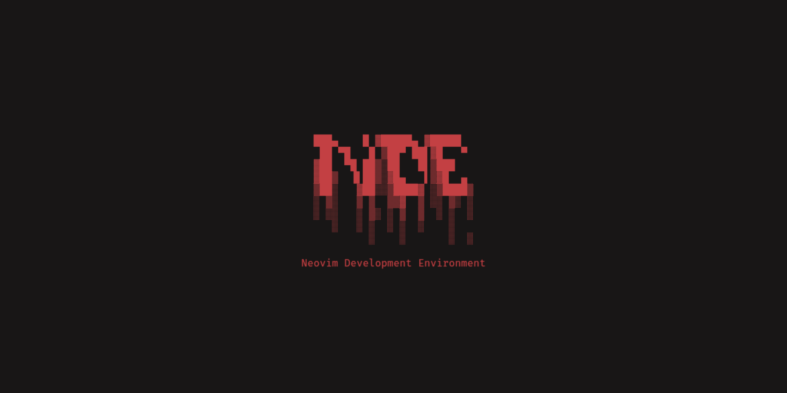

<div align="center">



A personalized, comprehensive Neovim development environment optimized for systems programming, web development, and general coding workflows. This configuration features extensive language support, debugging capabilities, clipboard management, and a beautiful Kanagawa-themed interface.

[](#platform-support)
[](#requirements)
[](#language-support)
[](#license)

</div>

## Features

### Plugin Management

- Modern plugin management with Lazy.nvim
- Lazy loading for optimal startup performance
- Automatic plugin installation and updates
- Lock file for reproducible environments

### Development Toolchain

**Language Servers:** Pyright (Python), TypeScript/JavaScript (ts_ls), C/C++ (Clangd), C# (OmniSharp), Rust (rust_analyzer), Go (gopls), Java (jdtls), Lua (lua_ls), Assembly (asm_lsp), HTML, CSS, Tailwind CSS, Emmet, JSON, YAML, Markdown, TOML, Bash, Docker  
**Code Formatters:** Black, isort, Prettier, Clang-format, stylua, shfmt  
**Linters & Diagnostics:** mypy, shellcheck, ruff (Python), null-ls integration  
**Debuggers:** Python DAP, C/C++ DAP, multi-language debug adapter support  
**Development Utilities:** Ripgrep, fd-find, Lazygit, Tree, jq, built-in terminal

### User Interface & Developer Experience

- **Theme:** Kanagawa Dragon color scheme with consistent theming
- **File Navigation:** Telescope fuzzy finder + Neo-tree file explorer
- **Auto-completion:** nvim-cmp with multiple sources (LSP, buffer, path, calc, emoji, spell)
- **Syntax Highlighting:** Treesitter with context awareness and textobjects
- **Terminal Integration:** ToggleTerm with custom compile/run shortcuts (F5-F8)
- **Git Integration:** Gitsigns + Lazygit TUI
- **Status & UI:** Lualine status line, Bufferline tabs, Noice enhanced UI
- **Code Intelligence:** Auto-pairs, auto-tags, todo-comments highlighting
- **Debugging:** Full DAP integration with UI and virtual text
- **AI Assistance:** Codeium integration for AI-powered completion
- **Clipboard Management:** Yanky.nvim with history, cycling, and Telescope integration
- **Text Manipulation:** nvim-surround with organized which-key shortcuts

### Advanced Development Features

- **LSP Integration:** Full language server support with automatic installation via Mason
- **Debug Adapter Protocol:** Comprehensive debugging with DAP UI and virtual text
- **Code Quality:** Automatic formatting on save via null-ls, linting integration
- **Plugin Management:** Lazy.nvim with performance optimization and lazy loading
- **Quick Compilation:** Language-specific compile/run shortcuts (Python: F5, C++: F6, C: F7, ASM: F8)
- **Intelligent Navigation:** Custom Neo-tree toggles, smooth window management
- **Productivity Tools:** Comment toggling, trouble diagnostics, scroll indicators

## Installation

### Requirements

- **Neovim 0.10.0 or higher**
- Git
- Node.js and npm (for language servers)
- Python 3 and pip (for language servers)
- A Nerd Font (recommended for proper icon display)
- Internet connection for downloading plugins

### Setup

**1. Clone the repository:**

```bash
git clone https://github.com/Sckab/NDE.git ~/.config/nvim
```

**2. Install prerequisites:**
Make sure you have the required tools installed on your system:

- **Arch Linux:**

  ```bash
  sudo pacman -S neovim git nodejs npm python python-pip
  ```

- **Ubuntu/Debian:**

  ```bash
  sudo apt update
  sudo apt install neovim git nodejs npm python3 python3-pip
  ```

- **macOS (with Homebrew):**
  ```bash
  brew install neovim git node python
  ```

**3. Launch Neovim:**

```bash
nvim
```

On first launch, Lazy.nvim will automatically install all configured plugins. Mason will then install the necessary language servers, formatters, and linters.

**4. Install language servers (optional):**
While Mason handles most installations automatically, you can manually install additional tools:

```vim
:Mason
```

## Installed Components

### Core Development Environment

| Component      | Purpose                                 | Installation Method                    |
| -------------- | --------------------------------------- | -------------------------------------- |
| Neovim 0.10+   | Editor platform                         | Package manager + repository setup     |
| Node.js & npm  | JavaScript ecosystem & language servers | Package manager                        |
| Python 3 & pip | Python development & tools              | Package manager                        |
| .NET SDK       | C# development                          | Package manager / Microsoft repository |
| Rust toolchain | Rust development & tools                | rustup installer                       |
| Go             | Additional language server dependencies | Package manager                        |

### Development Tools & Utilities

| Category                | Tools                  | Description                                 |
| ----------------------- | ---------------------- | ------------------------------------------- |
| **Search & Navigation** | Ripgrep, fd-find, Tree | High-performance file search and navigation |
| **Version Control**     | Git, Lazygit           | Source control and terminal UI              |
| **Utilities**           | jq, curl               | JSON processing and data transfer           |

### Language Support Infrastructure

| Component Type            | Tools                                                                                                                                                                                                                 | Languages Supported                                                                                                                    |
| ------------------------- | --------------------------------------------------------------------------------------------------------------------------------------------------------------------------------------------------------------------- | -------------------------------------------------------------------------------------------------------------------------------------- |
| **Language Servers**      | pyright, ruff, ts_ls, eslint, clangd, rust_analyzer, omnisharp, gopls, jdtls, lua_ls, asm_lsp, bashls, html, cssls, tailwindcss, emmet_ls, jsonls, yamlls, marksman, taplo, dockerls, docker_compose_language_service | Python, JavaScript/TypeScript, C/C++, Rust, C#, Go, Java, Lua, Assembly, Bash, HTML, CSS, Tailwind, JSON, YAML, Markdown, TOML, Docker |
| **Code Formatters**       | Black, isort, Prettier, Clang-format, stylua, shfmt                                                                                                                                                                   | Python, Web technologies, C/C++, Lua, Shell scripts                                                                                    |
| **Linters & Diagnostics** | mypy, shellcheck, ruff, null-ls integration                                                                                                                                                                           | Python, Shell scripts, with conditional mypy support                                                                                   |
| **Debuggers**             | Python DAP, C/C++ DAP, Mason DAP adapters                                                                                                                                                                             | Python, C/C++, with extensible DAP support                                                                                             |

### User Interface Components

| Component             | Description      | Configuration                        |
| --------------------- | ---------------- | ------------------------------------ |
| **Terminal Emulator** | Kitty (optional) | Kanagawa theme integration           |
| **Fonts**             | Nerd Fonts       | FiraCode or JetBrainsMono options    |
| **Color Scheme**      | Kanagawa Dragon  | Consistent theming across components |

## Platform Support

| Platform    | Package Managers                 | Neovim Repository     | Status       |
| ----------- | -------------------------------- | --------------------- | ------------ |
| **Linux**   | apt, pacman, dnf, zypper, emerge | PPA/COPR auto-setup   | Full Support |
| **macOS**   | Homebrew, MacPorts               | Official repositories | Full Support |
| **Windows** | Chocolatey, winget               | Official repositories | Full Support |
| **WSL**     | Linux package managers           | PPA/COPR auto-setup   | Full Support |

## Language Support

| Language                  | LSP Server                | Code Formatter | Linter/Diagnostics        | Debugger    | Quick Run        | Status   |
| ------------------------- | ------------------------- | -------------- | ------------------------- | ----------- | ---------------- | -------- |
| **Python**                | Pyright + ruff            | Black + isort  | mypy (conditional) + ruff | debugpy     | F5               | Complete |
| **JavaScript/TypeScript** | ts_ls + eslint            | Prettier       | ESLint                    | DAP support | -                | Complete |
| **C/C++**                 | Clangd                    | clang-format   | Built-in                  | DAP support | F6 (C++), F7 (C) | Complete |
| **Rust**                  | rust_analyzer             | Built-in       | Built-in                  | DAP support | rust-tools       | Complete |
| **Assembly**              | asm_lsp                   | -              | -                         | DAP support | F8 (NASM)        | Complete |
| **C#**                    | OmniSharp                 | Built-in       | Built-in                  | DAP support | -                | Complete |
| **Go**                    | gopls                     | Built-in       | Built-in                  | DAP support | -                | Complete |
| **Java**                  | jdtls                     | Built-in       | Built-in                  | DAP support | -                | Complete |
| **Lua**                   | lua_ls                    | stylua         | Built-in                  | -           | -                | Complete |
| **HTML**                  | html + emmet_ls           | Prettier       | Built-in                  | -           | -                | Complete |
| **CSS**                   | cssls + tailwindcss       | Prettier       | Built-in                  | -           | -                | Complete |
| **Bash/Shell**            | bashls                    | shfmt          | shellcheck                | -           | -                | Complete |
| **JSON**                  | jsonls                    | Prettier       | Built-in                  | -           | -                | Complete |
| **YAML**                  | yamlls                    | Prettier       | Built-in                  | -           | -                | Complete |
| **Markdown**              | marksman                  | Prettier       | Built-in                  | -           | -                | Complete |
| **TOML**                  | taplo                     | Built-in       | Built-in                  | -           | -                | Complete |
| **Docker**                | dockerls + docker_compose | Built-in       | Built-in                  | -           | -                | Complete |

## Configuration Architecture

````
~/.config/nvim/
├── 📄 init.lua                 # Entry point
├── 📄 LICENSE                  # MIT License
├── 📄 README.md                # This file
└── 📁 lua/
    ├── 📁 GUI/
    │   └── 📄 theme.lua         # 🎨 Kanagawa theme configuration
    ├── 📄 keymaps.lua           # ⌨️  Custom key mappings & language shortcuts
    ├── 📄 launch.lua            # 🚀 Plugin loader
    ├── 📄 opts.lua              # ⚙️  Editor options
    ├── 📁 lazynvim/
    │   └── 📄 lazy.lua          # 📦 Lazy.nvim setup
    └── 📁 plugins/
        ├── 📄 autoformat.lua    # 🔧 Auto-formatting
        ├── 📄 autopairs.lua     # () Auto-pairs
        ├── 📄 autotag.lua       # 🏷️  HTML/XML auto-tagging
        ├── 📄 bufferline.lua    # 📑 Buffer tabs
        ├── 📄 cmp.lua           # 🔤 Auto-completion with multiple sources
        ├── 📄 codeium.lua       # 🤖 AI completion
        ├── 📄 comment.lua       # 💬 Smart commenting
        ├── 📄 dap.lua           # 🐛 Debug adapters
        ├── 📄 dashboard.lua     # 📊 Start screen (Alpha)
        ├── 📄 debug.lua         # 🐛 Debug configuration
        ├── 📄 gitsigns.lua      # 📝 Git integration
        ├── 📄 highlight-colors.lua # 🌈 Color highlighting
        ├── 📄 indent-blankline.lua # ┊ Indent guides
        ├── 📄 lint.lua          # 🔍 Linting
        ├── 📄 lualine.lua       # 📊 Status line
        ├── 📄 mason.lua         # 🔨 LSP installer (15+ language servers)
        ├── 📄 neotree.lua       # 🌲 File explorer
        ├── 📄 noice.lua         # 💬 Enhanced UI notifications
        ├── 📄 null-ls.lua       # 🔧 Formatting & diagnostics engine
        ├── 📄 oil.lua           # 🛢️  Alternative file manager
        ├── 📄 rainbow-delimiters.lua # 🌈 Rainbow parentheses
        ├── 📄 rust-tools.lua    # 🦀 Enhanced Rust development
        ├── 📄 surround.lua      # 🔄 Text object manipulation
        ├── 📄 telescope.lua     # 🔭 Fuzzy finder
        ├── 📄 todo-comments.lua # 📝 TODO/FIXME highlighting
        ├── 📄 toggleterm.lua    # 💻 Terminal integration
        ├── 📄 treesitter.lua    # 🌳 Syntax highlighting + context
        ├── 📄 trouble.lua       # 🚨 Diagnostics panel
        ├── 📄 which-key.lua     # 🔑 Keybinding helper with organized groups
        └── 📄 yanky.lua         # 📋 Clipboard manager with history

## Usage

### Initial Setup
Launch Neovim to complete the configuration:
```bash
nvim
````

The system will automatically:

1. Install all configured plugins via Lazy.nvim
2. Initialize language servers through Mason
3. Apply the Kanagawa theme configuration
4. Prepare the development environment

### Key Bindings

#### File Navigation & Management

| Keybinding   | Function              | Description                                  |
| ------------ | --------------------- | -------------------------------------------- |
| `<leader>ff` | File Search           | Search files using Telescope                 |
| `<leader>fg` | Content Search        | Live grep in files                           |
| `<leader>fb` | Buffer List           | Display open buffers                         |
| `<leader>fh` | Help Search           | Search help documentation                    |
| `<leader>fp` | Clipboard History     | Access yanky clipboard history via Telescope |
| `<leader>e`  | File Explorer (Root)  | Toggle Neo-tree from filesystem root         |
| `<leader>n`  | File Explorer (Local) | Toggle Neo-tree (smart focus switching)      |
| `<leader>bc` | Close Buffer          | Close current buffer                         |
| `<leader>bo` | Close Others          | Close all other buffers                      |

#### Language-Specific Quick Actions

| Keybinding | Function          | Description                                         |
| ---------- | ----------------- | --------------------------------------------------- |
| `<F5>`     | Run Python        | Save and execute Python file in vertical terminal   |
| `<F6>`     | Compile & Run C++ | Compile with g++ and execute in vertical terminal   |
| `<F7>`     | Compile & Run C   | Compile with clang and execute in vertical terminal |
| `<F8>`     | Assemble & Run    | Assemble with NASM, link with ld, execute           |

#### Debugging

| Keybinding   | Function          | Description                           |
| ------------ | ----------------- | ------------------------------------- |
| `<F1>`       | Toggle Breakpoint | Set/remove breakpoint at current line |
| `<F2>`       | Continue          | Continue debugging execution          |
| `<F3>`       | Step Into         | Step into function calls              |
| `<F4>`       | Step Over         | Step over current line                |
| `<leader>du` | Toggle DAP UI     | Show/hide debug interface             |

#### Clipboard Management (Yanky)

| Keybinding   | Function          | Description                                     |
| ------------ | ----------------- | ----------------------------------------------- |
| `<leader>fp` | Clipboard History | Open Telescope clipboard history picker         |
| `p`          | Yanky Put After   | Enhanced paste after cursor                     |
| `P`          | Yanky Put Before  | Enhanced paste before cursor                    |
| `<C-p>`      | Previous Entry    | Cycle to previous clipboard entry (after paste) |
| `<C-n>`      | Next Entry        | Cycle to next clipboard entry (after paste)     |

#### Text Manipulation (Surround)

| Keybinding           | Function        | Description                                      |
| -------------------- | --------------- | ------------------------------------------------ |
| `<leader>sa`         | Add Surround    | Add surrounding characters (ys + motion + char)  |
| `<leader>sc`         | Change Surround | Change surrounding characters (cs + old + new)   |
| `<leader>sd`         | Delete Surround | Delete surrounding characters (ds + char)        |
| `ys` + motion + char | Add Surround    | Direct surround add (e.g., ysiw" for quotes)     |
| `cs` + old + new     | Change Surround | Direct surround change (e.g., cs'" quotes)       |
| `ds` + char          | Delete Surround | Direct surround delete (e.g., ds" remove quotes) |

#### General Editing

| Keybinding    | Function          | Description                                  |
| ------------- | ----------------- | -------------------------------------------- |
| `<leader>j`   | Insert Line Below | Add empty line below cursor                  |
| `<leader>k`   | Insert Line Above | Add empty line above cursor                  |
| `<C-h/j/k/l>` | Window Navigation | Move between windows (works in terminal too) |
| `<C-Space>`   | Completion        | Trigger auto-completion                      |
| `<leader>f`   | Format Code       | Format current file                          |

### Administrative Commands

| Command          | Purpose           | Usage                                   |
| ---------------- | ----------------- | --------------------------------------- |
| `:Lazy`          | Plugin Management | Install, update, and manage plugins     |
| `:Mason`         | LSP Management    | Install and configure language servers  |
| `:Telescope`     | Fuzzy Finder      | Advanced file and content search        |
| `:Neotree`       | File Explorer     | Navigate project structure              |
| `:Trouble`       | Diagnostics Panel | Show workspace diagnostics and errors   |
| `:TodoTelescope` | TODO Search       | Find TODO/FIXME comments across project |
| `:DapUIToggle`   | Debug Interface   | Toggle debugging interface              |
| `:ToggleTerm`    | Terminal          | Open/close integrated terminal          |

## Customization

### Adding Language Support

To add support for additional programming languages:

1. **Language Server Configuration**: Edit `lua/plugins/mason.lua`
2. **Code Formatting**: Configure formatters in `lua/plugins/autoformat.lua`
3. **Linting Rules**: Add linter configuration to `lua/plugins/lint.lua`
4. **Debug Adapters**: Configure debuggers in `lua/plugins/debug.lua`

### Theme Customization

Modify visual appearance by editing `lua/GUI/theme.lua`. This file contains color scheme definitions and UI styling configuration.

### Keybinding Customization

Custom keybindings can be added to `lua/keymaps.lua`. Follow the existing pattern for consistency.

### Plugin Configuration

Individual plugin configurations are modularized in `lua/plugins/`. Each file corresponds to a specific plugin or feature set.

## Troubleshooting

### Neovim Version Compatibility

```bash
# Check Neovim version
nvim --version

# If version is below 0.10.0, update Neovim:
# Arch Linux
sudo pacman -S neovim

# Ubuntu/Debian (you may need to add the unstable PPA)
sudo add-apt-repository ppa:neovim-ppa/unstable
sudo apt update
sudo apt install neovim
```

### Plugin Management Issues

```vim
" In Neovim, reset plugins
:Lazy clean
:Lazy sync

" Reset language servers
:Mason
:MasonUninstallAll
:MasonInstall pyright typescript-language-server
```

### Dependency Resolution

If you're missing dependencies, install them manually:

```bash
# Check what's installed
which nvim node python3 git rg fd

# Install missing dependencies
# Arch Linux
sudo pacman -S ripgrep fd

# Ubuntu/Debian
sudo apt install ripgrep fd-find
```

### Manual Neovim Installation

If the automatic installation fails, you can install manually:

**Ubuntu/Debian:**

```bash
sudo add-apt-repository ppa:neovim-ppa/unstable
sudo apt-get update
sudo apt-get install neovim
```

**Fedora:**

```bash
sudo dnf copr enable agriffis/neovim-nightly
sudo dnf install neovim
```

**Arch Linux:**

```bash
sudo pacman -S neovim  # Usually has latest version
```

## Contributing

Contributions are welcome! Here's how:

1. 🍴 Fork the repository
2. 🌟 Create a feature branch
3. 💡 Make your improvements
4. 🧪 Test thoroughly
5. 📤 Submit a pull request

### Development Areas

- Platform support expansion
- Language configuration additions
- User interface enhancements
- Documentation improvements
- Bug fixes and performance optimizations

## License

This project is licensed under the [MIT License](LICENSE).

## Acknowledgments

- [Neovim](https://neovim.io/) - The editor that makes this possible
- [Lazy.nvim](https://github.com/folke/lazy.nvim) - Amazing plugin manager
- [Kanagawa](https://github.com/rebelot/kanagawa.nvim) - Beautiful color scheme
- [Mason](https://github.com/williamboman/mason.nvim) - Language server installer
- All the plugin authors who make Neovim amazing

> ⚠️ **Note:** If the installer fails to install certain dependencies or packages, please install them manually using your system's package manager or by following the official documentation for each tool.

---

<div align="center">

**Please consider starring this repository if you find it useful.**

_For detailed information and updates, visit:_  
[https://github.com/Sckab/NDE](https://github.com/Sckab/NDE)

</div>
